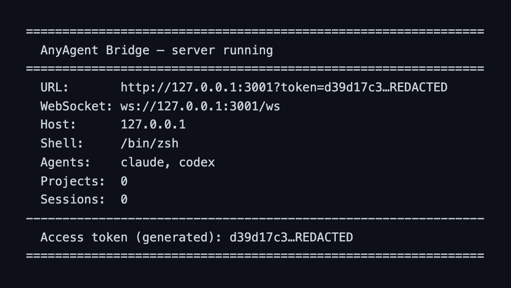
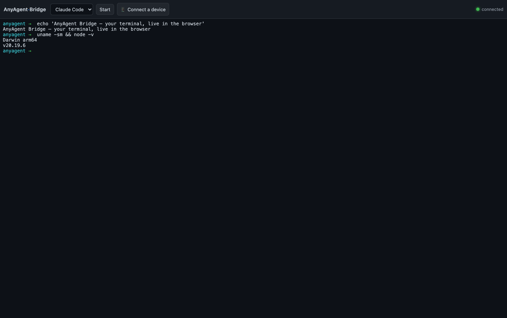
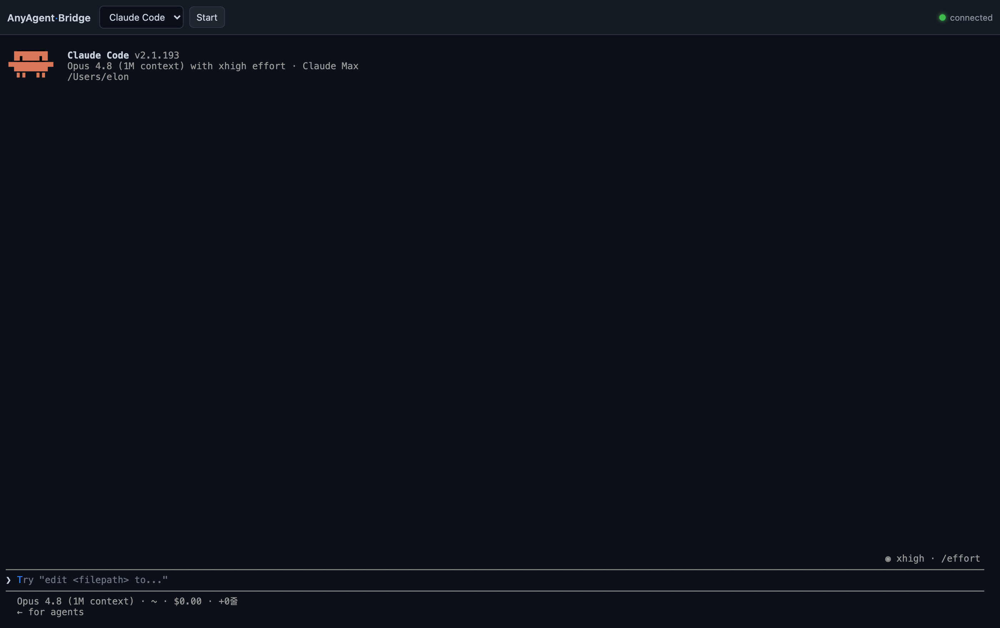
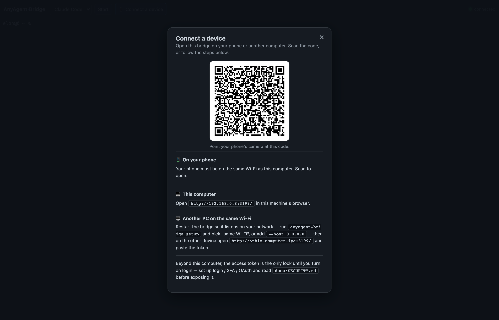
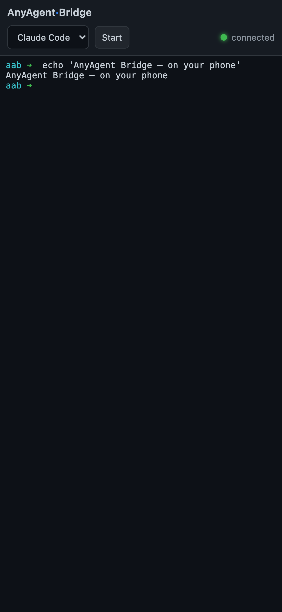

# Walkthrough

A guided tour of using anyagent-bridge end to end. The screenshots below live in
[`docs/screenshots/`](screenshots/); to regenerate them yourself, see the
[capture instructions](#capturing-screenshots).

## 1. Start the bridge

```bash
npx anyagent-bridge setup    # guided first-timer setup (recommended), or:
npx anyagent-bridge          # or: npm start  /  docker compose up -d --build
```

The startup banner prints the access URL and token:

```
===============================================================
  AnyAgent Bridge — server running
===============================================================
  URL:       http://127.0.0.1:3001?token=ab12…ef
  WebSocket: ws://127.0.0.1:3001/ws
  Host:      127.0.0.1
  Shell:     /bin/zsh
  Agents:    claude, codex
  ...
  Access token (generated): ab12…ef
===============================================================
```



## 2. Open the browser UI

Open the printed URL (the `?token=…` logs you in automatically), or visit
<http://127.0.0.1:3001> and paste the token. You land on the terminal view: a full
xterm.js terminal wired to a live shell on your machine, plus a toolbar with the
agent launcher, a file browser, and (if configured) project and tunnel controls.



## 3. Launch an AI agent

Pick an agent (e.g. **Claude Code**) from the dropdown and start it. The bridge
spawns the agent's CLI inside the session's PTY, so you interact with it exactly
as you would in your own terminal — streamed live to the browser. Type prompts,
send keys, and watch output in real time. Detaching the browser keeps the session
alive; reconnecting reattaches with full scrollback.



## 4. Browse and edit files

Use the file panel to browse, open, edit, upload, and download files within the
configured path whitelist. Image uploads are supported (handy for pasting a
screenshot to an agent).

## 5. Go remote (optional)

To reach the bridge from your phone or another machine, enable a tunnel — either
at startup (`--tunnel devtunnel`) or at runtime via the tunnel controls
(`POST /api/tunnel/start`). The banner and the UI show the public URL once it is
ready. Before exposing anything, read [SECURITY.md](SECURITY.md) and turn on
login / 2FA / OAuth.

The easiest way onto a phone: click **"📱 Connect a device"** in the top bar. It
shows a scannable QR for your current address (or a live tunnel), the localhost
link, step-by-step same-Wi-Fi instructions, and a one-click "Start internet
tunnel" — so you never type the long token on a phone.





---

## Capturing screenshots

The images above were captured locally against a running bridge. To regenerate
them yourself:

1. Start the bridge and note the token: `npm start`.
2. Open the printed URL in a browser (desktop and a phone/responsive view for the
   mobile shot).
3. Capture each state listed above and save it under `docs/screenshots/` with the
   matching filename (`01-startup-banner.png`, `02-terminal-view.png`, …).
4. PNG, ~1400px wide, is plenty. Crop out anything sensitive — **the token in the
   URL bar and any real file contents** — before committing.

Because the token grants full access, never publish a screenshot that shows a
live token, private file paths, or agent credentials.
